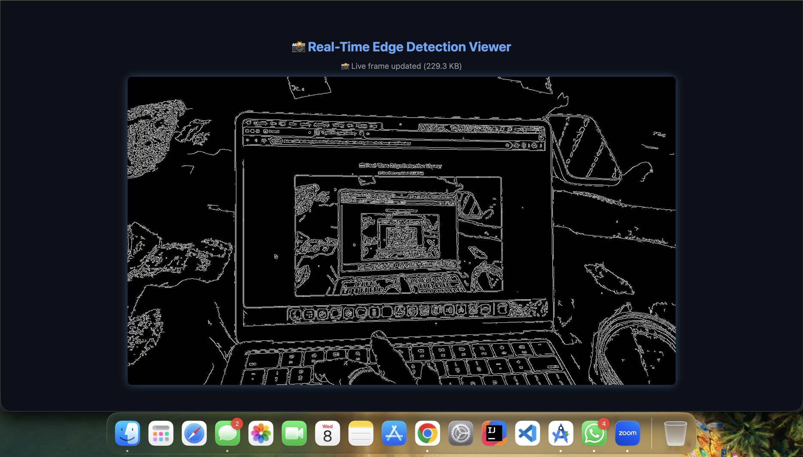

# Real-Time Edge Detection

A **cross-platform edge detection project** built using **Android (Camera2 + OpenCV + OpenGL ES)** and a **Web (TypeScript) viewer**.
This app captures real-time camera frames, processes them using OpenCV’s C++ library through JNI, and renders the output using OpenGL for smooth visualization.
The web interface allows visualizing processed frames and performance metrics.

---

## 🚀 Features

### 📱 Android Application

* Real-time camera capture using **Camera2 API**.
* Native frame processing via **C++ and OpenCV** for high performance.
* Live toggle between **Grayscale** and **Canny Edge Detection** modes.
* Smooth rendering using **OpenGL ES 2.0**.
* FPS and resolution overlay for performance insights.

### 🌐 Web Viewer (TypeScript)

* Displays a processed image from the Android app in a **canvas** element.
* Shows **FPS** and **resolution** dynamically.
* Minimal responsive interface using TypeScript + HTML5.

---

## 🧩 Project Structure

```
Real-Time-Edge-Detection/
│
├── README.md
├── .gitignore
├── build.gradle
├── gradle.properties
├── settings.gradle
├── gradlew / gradlew.bat
│
├── OpenCV-android-sdk/               # OpenCV SDK 
│
├── app/                              # Android module
│   ├── build.gradle
│   ├── CMakeLists.txt
│   ├── src/
│   │   └── main/
│   │       ├── AndroidManifest.xml
│   │       ├── java/com/example/edgedetect/
│   │       │   ├── MainActivity.kt
│   │       │   ├── Camera2Fragment.kt
│   │       │   ├── NativeBridge.kt
│   │       │   └── GLRenderer.kt
│   │       ├── cpp/
│   │       │   ├── CMakeLists.txt
│   │       │   └── native-lib.cpp
│   │       └── res/layout/
│   │           ├── activity_main.xml
│   │           └── fragment_camera2.xml
│
├── jni/                              # Optional external JNI C++
│   ├── CMakeLists.txt
│   └── native-lib.cpp
│
├── web/                              # Web viewer
│   ├── index.html
│   ├── src/main.ts
│   ├── package.json
│   ├── tsconfig.json
│   └── dist/main.js
│
├── docs/                             # Project documentation
│   ├── images/
│   │   ├── screenshot1.png
│   │   ├── screenshot2.png
│   │   └── ui_layout.png
│   ├── gifs/
│   │   ├── demo_edge.gif
│   │   └── real_time_processing.gif
│   └── architecture_diagram.png
│
└── LICENSE
```

---

## 📸 Screenshots & Demos

### Android App

| Edge Detection Mode                       |
| ----------------------------------------- |
|  |

### 🎞 Real-Time Demo


---

## 🛠️ Setup Instructions

### Prerequisites

* **Android Studio** (with NDK & CMake)
* **Android NDK** (r21 or newer)
* **OpenCV Android SDK**
* **Node.js + npm** (for web viewer)

---

### ⚙️ Android Setup

1. **Install NDK & CMake**

   * Open *Android Studio → Preferences → SDK Tools*
   * Enable *NDK* and *CMake* installation.

2. **Add OpenCV SDK**

   * Download OpenCV Android SDK (e.g., `opencv-4.x-android-sdk`).
   * Place it in the project root or reference it globally.
   * Update your `CMakeLists.txt`:

     ```cmake
     set(OpenCV_DIR ${CMAKE_SOURCE_DIR}/../OpenCV-android-sdk/sdk/native/jni)
     find_package(OpenCV REQUIRED)
     include_directories(${OpenCV_INCLUDE_DIRS})
     target_link_libraries(native-lib ${OpenCV_LIBS} log)
     ```

3. **Permissions**

   * Add these to `AndroidManifest.xml`:

     ```xml
     <uses-permission android:name="android.permission.CAMERA" />
     <uses-permission android:name="android.permission.WRITE_EXTERNAL_STORAGE" />
     ```

4. **Build & Run**

   * Connect a physical Android device.
   * Run the project from Android Studio.
   * Switch between **Edge** and **Grayscale** modes using the toggle button.

---

### 🌐 Web Viewer Setup

1. Open a terminal and navigate to `/web`:

   ```bash
   cd web
   npm install
   ```
2. Build the TypeScript project:

   ```bash
   npm run build
   ```
3. Open `index.html` in a browser, or serve locally:

   ```bash
   npx live-server
   ```
4. Replace the placeholder `base64Image` in `src/main.ts` with an exported base64 image from your Android app.

---

## 💡 How It Works

1. The **Camera2 API** captures each frame (YUV format).
2. Frames are sent via **JNI** to **C++ OpenCV** for processing.
3. OpenCV applies **Grayscale** or **Canny Edge Detection**.
4. Processed RGBA frames are returned to Kotlin and rendered via **OpenGL ES 2.0**.
5. The **Web Viewer** displays static processed images and performance overlays.

---

## 📈 Performance Notes

* Real-time processing achieved using **NDK + OpenCV C++**.
* **OpenGL ES** ensures smooth texture rendering on device.
* For best FPS, prefer **640×480** camera resolution.
* Edge detection algorithm: *Canny* with thresholds (80, 120).

---

## 🧠 Architecture Overview


---

## 🧰 Tech Stack

**Android**

* Kotlin
* Camera2 API
* OpenCV (C++)
* OpenGL ES 2.0
* JNI bridge

**Web**

* TypeScript
* HTML5 Canvas
* npm / live-server
ng native C++ speed with modern Android and web technologies to achieve real-time vision performance.”
